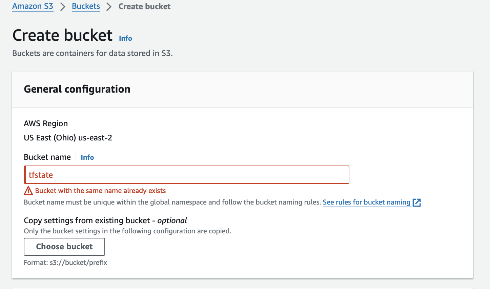

[Return to main page](../README.md)

# Configure AWS Services

Here we will [Create S3 Bucket](#create-s3-bucket) that will be used for the terraform state file,  [Create CLI Admin](#create-cli-admin) that will be used by the AWS CLI, and [Create CLI Admin Keys](#create-cli-admin-keys) for the admin cli. Then we will [Create Admin Group](#create-admin-group) and add the CLI Admin user to it. You can also create the group first and then add the user to the group during user creation. 

## Create S3 Bucket 

1. We'll be using Terraform to provision and maintain our infrastructure. Terraform maintains a state file which can be stored in a backend service. 

2. While in the AWS Console, search for " S3 " (without quotes).  The top result should be "S3 - Scalable Storage in the Cloud" and select it.

3. On "General purpose buckets" select Create bucket.
   Note: Bucket names must be unique for the entire service region.

   

   Use a random name that also makes sense. Example:

   

4. Block Public Access and Enable Bucket Versioning.
   Note: Versioning is not required but recommended.  With versioning enabled, you can restore the terraform environment to a previous state.  We will cover this later in the Terraform module. 

   

5. Keep the defaults for Encryption and Bucket key.

  

6. Click "Create bucket" to complete the process. 

## Create CLI Admin 

1. Return to the home page by clicking the "aws" icon in the upper left corner of the dashboard.

2. Search for " Users " (without quotes) and select "Users IAM feature". 

3. Click "Create user" in the upper right corner. 

4. For this demo we will be creating "aws-at-pg-admin" but you can use any name. This is only to associate the keys with a name. The ID will not have console access.

5.  Skip the group for now and review and create:

 

## Create CLI Admin Keys

1.  Click the "aws-at-pg-admin" from the Users list, then select "Security credentials"

2.  Scroll down to "Access key" and click "Create"

3.  For this demo, we wil select "Command Line Interface (CLI)" and accept the warning

6.  Optionally add a description and select "Create access key"

 
IMPORTANT: This is the only time that the Secret access key will be visible . Show the Secret access key. Copy they key and store in a secure place for later use.  We will use this key when we configure the AWS CLI. 

## Create Admin Group

1. After creating the CLI key, click "User groups" above users in the left nav. 

2. Create awsadmin group and add the aws-at-pg-admin ID that we created above. 
   Reminder - Optionally create the group first and assign to user during user creation. 

3. Now attach the AdministratorAccess policy to the group and create.

4. This completes the console work. Next will [Install and Configure the AWS CLI](./Install-Configure-AWS-CLI.md)

