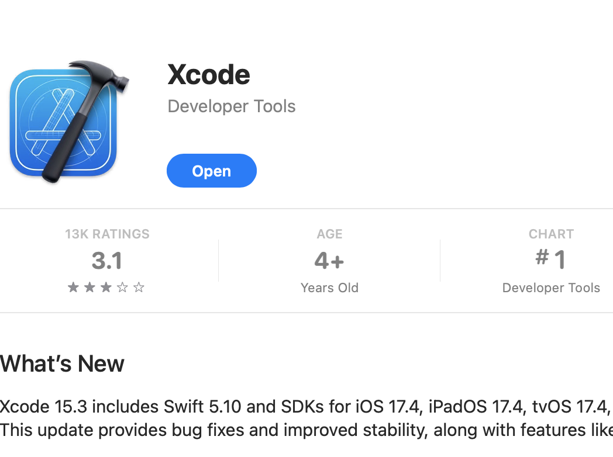

[Return to main page](../README.md)

# Install and Configure the AWS CLI


 This page will walk through installing the AWS CLI on [MAC OS](#mac-os) and [Windows](#windows). The client is also available linux distributions and those steps may be added at a later date.  Once the AWS CLi is installed we need to [configure it.](#configure-the-aws-cli)


# MAC OS

AWS does provided a packaged installation for the CLI [here: https://docs.aws.amazon.com/cli/](https://docs.aws.amazon.com/cli/latest/userguide/getting-started-install.html)  but we'll be using Brew for this demo as we will also be using brew for Ansible, Python and Terraform. 


1. Instal Xcode from the App Store  

2. Install Homebrew using curl from a terminal session:

Dump the install script to a file

```diff
curl -fsSL https://raw.githubusercontent.com/Homebrew/install/HEAD/install.sh -o install-brew.sh

```
Check contents of the install-brew.sh

```diff
more install-brew.sh

```

Now run the install script

```diff
/bin/bash install-brew.sh

```

Note:  You can do all is in one step if your are comfortable directly executing  scripts from websites but best to view what you are running first.

3. The AWS CLI requires Python3 and OpenSSL which we wil install using brew

```diff
brew install python3

```

```diff
brew install openssl

```

4. Now we can install AWS CLI

```diff
brew install awscli

```

# Windows 

The AWS CLI does run natively in Windows. However, ansible which is part of this project does not. For consistency it's recommended to install all 3 components in the Windows Sub System for Linux.  See the AWS documentation here: [https://docs.aws.amazon.com/simspaceweaver/1.15/userguide/setting-up_local_wsl.html](https://docs.aws.amazon.com/simspaceweaver/1.15/userguide/setting-up_local_wsl.html)


# Configure the AWS CLI

1. First verify the cl is installed:

```diff
aws --version 

```

2. Next run aws-configure. You will be prompted for the Access Key and Secret Key what we created for the aws-at-pg-admin user here -  [Configure AWS Services](./Configure-AWS-Services.md). Lost the Secret key?  No worries. Follow the scripts to create a new one and be sure to deactivate the lost key. 


```diff
aws configure 

```

AWS Access Key ID [****************]:   <br>
AWS Secret Access Key [****************v]:   <br>
Default region name [us-east-1]:   <br>
Default output format []:    <br>

5. Very the aws credentials are working by listing your S3 bucket

```diff
aws s3 ls 

```

6. Our AWS CLI is ready.  Now let's [Install Terraform](./Install-Terraform.md).  Already have terraform installed? Jump to [Configure S3 and Provision VPC](./Configure-S3-and-Provision-VPC-Terraform.md) 

