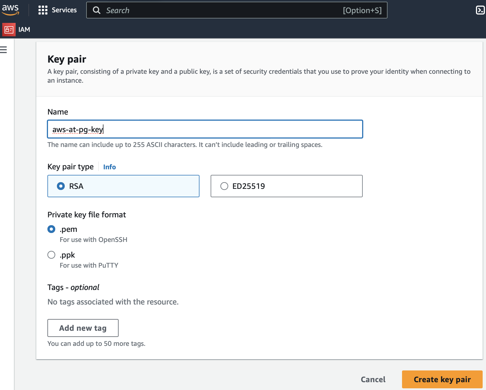

[Return to main page](../README.md)

# Provision EC2 Nodes


We've created our VPC. We provisioned our Network. We defined our Security Group.  Now we'll create EC2 nodes on that network in the VPC using the security group.  

AWS EC2 Nodes are created with a default user id "ec2-user". We'll be creating an SSH key-pair for password-less access into the nodes. The "aws_key_pair" terraform resource does support this. However, it currently requires passing an existing public key.  We'll create the key-pair in the AWS console and reference it as a variable to our EC2 files.


# SSH Key Pair

1. Navigate to the EC2 Dashboard [https://us-east-1.console.aws.amazon.com/ec2/home?region=us-east-1#Home:](https://us-east-1.console.aws.amazon.com/ec2/home?region=us-east-1#Home:) and select "Key pairs".


2. Click "Create key pair" in the upper right corner. 


3. Set the name tp "aws-at-pg-key". The type is "RSA" and private key file is "pem". 




4. Click "Create key pair". This will download a file your workstation "aws-at-pg-key.pem". Save this file for later. We'll use it to ssh into the nodes.


# Building the nodes. 

1. Make the nodes subdirectory in the main and create a file called variables.tf. This will reference the vpc_id and subnet_id as well as new variables we recently created.

./nodes/variables.tf
```diff
variable "playground_vpc_id" {
  type        = string
  description = "The VPC ID created in vpc module"
}

variable "private_playground_subnet_us_east_1a" {
  type        = string
  description = "The subnet created in network module"
}

variable "aws_secure_group_id" {
  type        = list(string)
  default     = ["limited_access"]
  description = "The security group created in secure module"
}

variable "key-name" {
 default     = "aws-at-pg-key"

}

```

The security_groups is a list. Here we create the variable as type list with a default value of our limited access group. The variable "key-name" has the default of "aws-at-pg-key" which we created in the AWS console.  


2. Create a file called ec2-ans-prime.tf in the nodes directory. This has several new settings that we'll cover below. 

./nodes/ec2-ans-prime.tf
```diff
resource "aws_instance" "ans_prime" {
  lifecycle {
    prevent_destroy = true
    ignore_changes = [
      # Ignore changes to security_groups
      security_groups
    ]
  }

  ami             = data.aws_ami.amzn-linux-2023-ami.id
  key_name        = var.key-name
  security_groups = var.aws_secure_group_id
  instance_type   = "t2.nano"
  subnet_id       = var.private_playground_subnet_us_east_1a_id


  tags = {
    Name = "ans-prime"
  }
}

```

New fields the ec2-ans-prime.tf

# Lifecycle 
The aws_instance module will destroy and recreate nodes when there are changes to the security group. We'll be making updates to that group later and want to avoid the destroy. To avoid that we use a terraform lifecycle argument with instruction to ignore changes to security_groups. 

# Data Objects. 
Notice the "ami" has a value of "data.aws_ami.amzn-linux-2023-ami.id". Terraform can reference existing objects in the environment. An ami is an Amazon Machine Image which is managed by Amazon. We need to declare this object and make it available.


2. In the nodes subdirectory create a file called aws-ami.tf

./nodes/aws-ami.tf
```diff
data "aws_ami" "amzn-linux-2023-ami" {
  most_recent = true
  owners      = ["amazon"]

  filter {
    name   = "name"
    values = ["al2023-ami-2023.4.20240416.0-kernel-6.1-x86_64"]
  }
}

```
Here we are filtering through the available AMIs and selecting "2023-ami-2023.4.20240416.0-kernel-6.1-x86_64" for our image. We'll update this in a future release to demonstrate a Rip and Replace upgrade. 


3. Add the nodes module to main.tf

sub section of ./main.tf
```diff
module "nodes" {
  source                                  = "./nodes"
  playground_vpc_id                       = module.vpc.playground_vpc_id
  private_playground_subnet_us_east_1a_id = module.network.private_playground_subnet_us_east_1a_id
  aws_secure_group_id                     = [module.secure.aws_secure_group_id]
}

```

Notice the aws_secure_group_id is in brackets. As we mentioned in variables.tf, this value is a list and should exist in brackets. Let's initial the nodes module, then we'll remove the brackets to see the error.


4. Run terraform init to configure the nodes module

```diff
terraform init

```
Initializing the backend...
Initializing modules...
- nodes in nodes
terraform plan


5. Now as a test, remove the brackets in main.tf for aws_secure_group_id  and run terraform plan
 
  Planning failed. Terraform encountered an error while generating this plan.

╷
│ Error: Invalid value for input variable
│ 
│   on main.tf line 34, in module "nodes":
│   34:   aws_secure_group_id                     = module.secure.aws_secure_group_id
│ 
│ The given value is not suitable for module.nodes.var.aws_secure_group_id declared at
│ nodes/variables.tf:12,1-31: list of string required.


6. Restore the brackets to aws_secure_group_id  and run the apply and plan to create our EC2 node.
```diff
terraform plan
```

```diff
terraform apply
```

module.nodes.aws_instance.ans_prime


7. You can use the aws cli to see the status of this node

```diff
 aws ec2 describe-instances --filters "Name=tag:Name,Values=ans-prime"
```

8. Let's provision a second node with different tags. Copy ec2-ans-prime.tf tp ec2-ans-client-1.tf . Edit c2-ans-client-1.tf  and change the following:

```diff
resource "aws_instance" "ans_client_1" 
```
and

```diff
 tags = {
    Name = "ans-client-1", webserver = "true"
  }
```
Everything else remains the same. 


9. Terraform plan and apply. 

module.nodes.aws_instance.ans_client_1: Creating..


10. Note: To remove / destroy the nodes when no longer in use, rename the config to something that does not end in tf. 

Example:
```diff
mv ec2-ans-client-1.tf ec2-ans-client-1.tf-keep
```
Run the terraform plan and apply which will show the nodes are being destroyed. This is a good way to cut down on AWS cloud costs. As we'll see in the ansible modules, we can quickly restore the nodes to original state.


11. Use the aws cli to check the status

```diff
aws ec2 describe-instances --filters "Name=tag:Name,Values=ans-client-1"
```

# SSH into the nodes

Next we'll use the key-pair that we created earlier to ssh into the nodes and become root.

1. Use the aws cli to get the public IP address for ans-client-1

```diff
aws ec2 describe-instances --filters "Name=tag:Name,Values=ans-client-1" --query 'Reservations[*].Instances[*].[PublicIpAddress]'

```


2. Locate the file "aws-at-pg-key.pem" that you created for the [SSH Key Pair](#ssh-key-pair).


3. Export a variable that references the key. (assuming the key is in a directory called ./aws)

```diff
export SSH=/aws/aws-at-pg-key.pem

```


4. Now ssh into the node as ec2-user using the aws-at-pg-key.pem and the Public IP address for ans-client-1

Example:
```diff
ssh -i $SSH ec2-user@34.204.78.13
```
This key is not known by any other names.
Are you sure you want to continue connecting (yes/no/[fingerprint])? yes
Warning: Permanently added '34.204.78.13' (ED25519) to the list of known hosts.

Since this is your first time accessing this node, reply yes.

Warning: Permanently added '34.204.78.13' (ED25519) to the list of known hosts.


5. Next use sudo to become root

```diff
sudo su -
```


6. That's all for now We'll do more with terraform after we get ansible going. [Install Ansible](./Install-Ansible.md). Already have ansible? Jump to  [Create the ansible configuration and inventory](./Create-ansible-configuration-and-inventory.md)